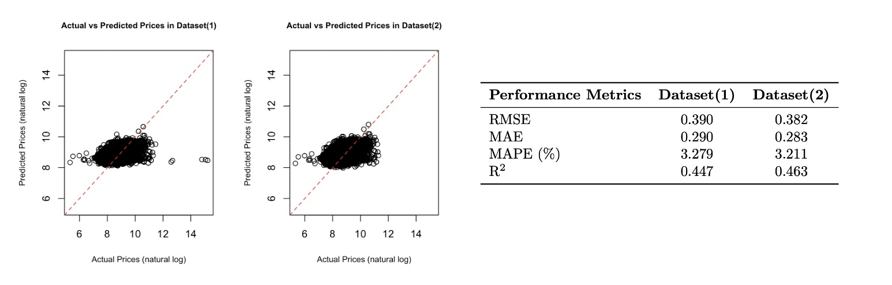
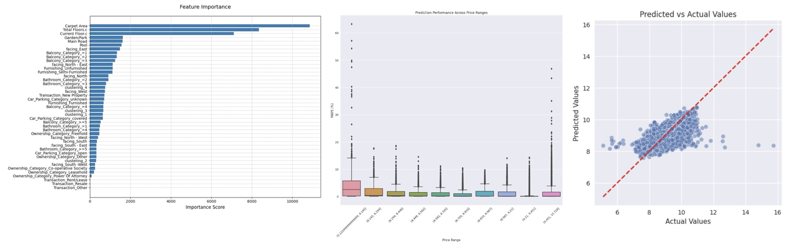

# Real Estate Price Estimation Using Machine Learning Approaches

```{r setup, include=FALSE}
knitr::opts_chunk$set(echo = TRUE)
```


# Abstract

This study developed and compared two machine learning approaches — Elastic Net and LightGBM — for predicting house prices (per sqft) in India housing market using a dataset from Kaggle of the year 2023. The LightGBM model demonstrated superior performance with RMSE and outperforming the Elastic Net model. Feature importance analysis showed that physical attributes such as carpet area, floor level, and overlooking features were the strongest predictors of house prices. Although lightGBM demonstrated relatively high predicitve power, model of this project is still limited due to reliance on a single data source and the its reduced prediction accuracy for properties in extreme price ranges. Our project provide an insights for the development of practical price referencing tools in the Indian real estate market of 2023.


# Introduction

Accurately determining the market value of properties is a critical step in the home-selling process, which would provide great benefits for both buyers and sellers in today's dynamic real estate market. The price of a property is influenced by a variety of factors, including its location, floor area, number of rooms, and additional features such as balconies and amenities. Local market conditions, neighborhood development, and infrastructure nearby also play critical roles in determining housing price. Our project, hence, aims to develop a predictive model that estimates house prices (per sqft) of India based on property attributes, thus providing a practical price referencing tool for house agents, buyers, and sellers in the real estate market.

The dataset used in this data modeling is derived from real estate listings on agent websites in India in 2023 (Bhojani, 2023), offering a snapshot of the Indian housing market. By using machine learning approaches, we expect to reveal the underlying patterns between housing features and its market values. Specifically, we will employ and evaluate the performance of two distinct modeling approaches that can handle high dimentional dataset — Elastic Net and LightGBM. Elastic Net combines the benefits of ridge and lasso regression, offering a balanced approach to feature selection and regularization, while LightGBM represents a more sophisticated gradient boosting framework with great predictive power. We aim to identify the most effective model for accurate price estimation and potentially looking for the relationship between house features and housing price.


## Data Exploration and Cleaning:


The initial step of our modeling was focused on data exploration and cleaning. The dataset we utilized in this project was scraped from the Magic Bricks website, which is available on Kaggle by Bhojani Juhi (https://www.kaggle.com/datasets/juhibhojani/house-price). The dataset contained 187,531 observations with 21 covariates. An initial exploratory analysis was conducted to assess the data quality, identify missing values, and convert variables to appropriate data types. After the exclusion of unique identifiers, unique housing descriptions, and covariates with a considerable number of missing values (>= 50%), the dataset retained the following features: Location, Carpet area, Floor, Transaction, Furnishing, Facing, Overlooking, Bathroom, Balcony, Car parking, and Ownership. We deliberately chose not to conduct missing value imputation, given most of our categorical covariates consisted of more than four categories. This was based on two considerations: first, imputation without additional contextual information could introduce false information; second, missing values in real estate data can carry inherent meaning that is valuable for house price prediction modeling since it is usual to have missing values when the seller or buyer wish to make housing price predictions Therefore, we preserved missing values as blank entries during the LightGBM modeling process to maintain data integrity and potential predictive significance; another version of dataset which eliminate all observations with missing values was used for the Elastic Net modeling.

# Model Development

**Data**

*Test and training split:*


In this step, we divided the dataset into training and testing sets to evaluate and compare the performance of machine learning model prediction accuracies. The target variable is the “Price (in rupees)” column and the feature variables are the rest of the columns in the dataset. We split the data into training and testing sets, with 80% of the data used for training and 20% for testing. 


*Numerical variables:*


We first split the floor variable into two sub-covariates: current floor and total floor. We then applied standardization to our numerical variables due to their skewness. The reason for this standardizing process is to balance the feature weights, as the model may give more weight to large-valued features when the range of feature values varies widely (e.g., some carpet areas are in the thousands, while the floor may be in the single digits). In addition, standardization makes data more suitable for linear models or models that require gradient optimization (e.g., Elastic Net). For lightGBM, standardization can also help the model converge quickly. 

*Categorical variables:*


In our datasets, location (by city), transaction (new or resale), furnishing (None, Semi, or Fully), facing direction, overlooking (view from the home), car parking (open or covered), Ownership status (Freehold, Leasehold, Co-op, etc) are categorical variables. One-hot encoding transforms categorical variables into a series of binary variables, with each category represented by a column containing 1 for the respective category and 0 otherwise. One-hot encoding is applied to deal with the categorical columns with several categories in our datasets. This allows our models to handle category features without introducing ordering assumptions.


We handled the he location variable (81 categories) in a different way. In order to address the high dimensionality of this variable and also make location more generalizable to other regions with similar economic performances, we employed a K-means clustering approach based on Consumer Price Index (CPI) data from official Indian government sources in 2024 (reference), as it can be one of the representative features for the average socioeconomic status of the residence of the city of the year 2023. After clustering, we identified locations with similar socioeconomic status and assigned them to four distinct clusters based on their similarity.


### Data Modeling


**1) Elastic Net:**


*Model Description:*


Elastic Net is a regression-based method that uses two types of regularization, L1 (Lasso) and L2 (Ridge). Our dataset contains some variables with high dimensionality such as “location”, as well as variables that are highly correlated to each other such as “carpet area” with “super area” or “current floor” with “total floors”. Elastic Net is effective at handling high dimensionality and multicollinearity. It is also possible to balance the effects of the L1 and L2 regularization with a mixing parameter, making this a flexible model.


*Model Construction:*


Since Elastic Net can not handle missing values, we only conducted analyses on two dataset variations: (1) a dataset with all complete cases (no missing values), and (2) a refined dataset excluding both missing values and outliers. Given the wide range of housing prices (response), we applied a logarithmic transformation to Price to enhance model performance. 10-fold cross-validation was used for tuning the parameters in the model. We selected the best alpha for the model based on minimizing MAPE, RMSE, and MAE, and the best lambda where MSE has small value and standard deviation. According to the results of cross-validation, we finally chose alpha = 0.05 for both datasets, lambda = 0.087 for dataset(1) and lambda = 0.034 for dataset(2).


*Model Performance:*


The Elastic Net model did not perform as well as we expected on data prediction. As shown in *Figure 1* The two datasets demonstrated no significantly different predictive performances. The performance of Elastic Net is shown in *Table 1*, the RMSE, MAE, MAPE and $R^2$ in the dataset(2) are all smaller than that in the dataset(1), indicating that Elastic Net performs better on the refined dataset excluding both missing values and outliers, but that improvement is not significantly different. Overall, the RMSE, MAE, and MAPE are approximately 0.390, 0.290, and 3.21% respectively. In addition, $R^2$ is about 0.46. This shows that Elastic Net did perform ideally on our testing dataset.

```{r, echo=FALSE, out.width="100%", fig.cap="placeholder",fig.align='center'}

```

**2) LightGBM:**


*Model Description:*


LightGBM (Light Gradient Boosting Machine) is a modeling approach based on leaf-wise decision tree algorithms and implements the gradient boosting algorithm efficiently. This modeling method supports parallel and GPU-based learning, enabling faster training on large datasets with high dimentianlity, and handles missing values automatically. Hence, this approach was ideal for the large dataset we were analyzing in this project. In conclusion, LightGBM has higher speed, scalability, accuracy, and memory efficiency advantages compared to traditional gradient boosting and random forest methods.


*Model Construction:*


The lightGBM model used GPU acceleration to reduce computational time. We conducted analyses on four dataset variations: (1) the complete dataset with missing values, (2) a dataset with missing values but excluding outliers, (3) a dataset with all complete cases (no missing values), and (4) a refined dataset excluding both missing values and outliers. The latter two datasets were used to compare the performance between elastic net regression and lightGBM approaches. Given the wide range of housing prices (response), we applied a logarithmic transformation to Price to enhance model performance. Early stopping with a patience value of 50 iterations was applied to prevent overfitting. Additionally, to find the optimal hyperparameter combination for the model, hyperparameter tuning was performed with a 5-fold cross-validation using *RandomizedSearchCV()*.


*Model Performance:*


The LightGBM model yielded generally good performance for data prediction. The four datasets demonstrated similar predictive performances, with the dataset without missing values and outliers performing the best as expected. Focusing on the predictive performance of our model, the RMSE of the four models ranged between 0.23 to 0.27, with MAE ranging from 0.11 to 0.13 and MAPE ranging from 1.25% to 1.46%. These relatively small metrics revealed a generally good fit for our constructed model. In addition, with $r^2$ ranging from 0.75 to 0.81, our model also explained most of the variances of the residual in the test dataset, which suggested a good model prediction performance. In addition, the model’s prediction performance is visualized in *Figure 2*, with the middle section greatly outperforming the lowest and highest price areas.


```{r, echo=FALSE, out.width="100%", fig.cap="placeholder",fig.align='center'}

```

 
Feature importance was also assessed with the best model (*Figure 2*), and the top 10 most important features were carpet area, the total floor of the building, the floor of the house, overlooking (main road, pool, garden/park), whether the housing facing east, and the number of balconies (1, 2, or 3). In general, features closely related to the housing itself, e.g., the carpet area of the house and the overlooking, are generally examined to hold more importance than features having less connection to the housing itself, such as the transaction type.

## Discussion and Limitations:


LightGBM outperforms the elastic net model for predicting house prices in our project (*Table 2*). We attribute this difference in predicting power to the following factors. In terms of model characteristics, lightGBM, being a gradient boosting decision tree approach, can handle nonlinear relationships combined with complex feature interactions automatically, while elastic net is greatly limited by its linear assumptions. The total floor, current floor, and carpet area are the most influential features as shown previously, and their non-linear relationship with the price might be the reason for the prediction performance reduction of elastic net. The high variance also introduces difficulties to elastic net modeling process, which lightGBM handles naturally. Furthermore, LightGBM has built-in capabilities for handling missing values, making it more suitable for real-world housing data, whereas elastic net model requires manual preprocessing and imputation, making it less efficient for application.


Through LightGBM modeling, we could assess the covariates' feature importance in our data. By far, the most important features were the carpet area, total floors, and the current floor of the property. Carpet area being an important feature makes sense, as once a new homeowner has moved in, it’s better to have more space for furniture and other belongings which make the home a more comfortable place to live. In addition, having an apartment or flat on a higher floor is usually more desirable for a nicer view. After that, the scenery that the home was overlooking (Garden/Park, Main Road, Pool) was relatively important as well. This may partially be because home buyers desire a pleasant view, but these categories also show what the area around the home is like. For instance, a home in a dense urban area will most likely have a view of a road, while a view of a pool means that there is, in fact, a pool nearby. 


In addition, as shown in our model, location is not one of the most critical factors for predicting house prices. This could be due to the location variable in this project was recategorized into 4 clusters based on Consumer Price Index (CPI) data from official Indian government of the year 2024. While this clustering approach might help enhance model generalizability beyond the original 81 cities, it potentially oversimplifies the complex relationship between location and housing price. Although CPI provides insight into regional socioeconomic status, it may not fully capture other crucial determinants of housing prices, e.g., weather, urban infrastructure, or accessibility to healthcare services. The model's predictive capability could be enhanced by incorporating additional indicators that can better reflect the nature of housing price across different locations, thus potentially improving the model's accuracy while maintaining its generalizability to locations outside of these 81 cities. Another possible reason is that our project examines house prices across 81 cities in India, the location variable refers to the city where houses are located. However, that variable may not fully capture the information needed to explain variations in house prices. Factors like the specific address of houses, which can influence proximity to central business districts (CBDs), schools, healthcare, and other amenities, are often more significant determinants of house prices.


The model has a generalizability issue, as it was only trained on data from a single. The limited data source may affect the model's reliability when applied to property listings from other real estate websites or alternative sources, such as social media, newspapers, etc. The dependence on a single data source could potentially introduce selection biases and, hence, not fully represent the overall real estate market. Additionally, data quality concerns might have influenced the performance of our models. We excluded properties with prices below 100 per square foot due to apparent inconsistencies between the price values and their property descriptions, e.g., housing worth a fortune showing a price of zero. These errors in the original dataset suggest the presence of data entry errors, especially. An accurate dataset, potentially incorporating more sources, would likely improve both the model's performance and generalizability.


Performances of the model prediction, as previously illustrated in *Figure 2*, revealed noticeably less predicting power in both lower and higher price ranges. The poor performance in the lower prices likely is attributed to data quality issues. As there are errors in housing prices below 100 sqft, we expect that prices just above this threshold might also contain wrong values and affect the model's predictive accuracy in this range. The reduced accuracy in the higher price area might be due to our feature recategorization approach. Our decision to reduce model complexity by reducing dimensions of categorical covariates such as bathroom count and balcony numbers (grouping all values above 5 into a single category) may have oversimplified the representation of higher prices. Future models could benefit from a more accurate representation of these features.

**References:**


Bhojani, J. (2023). House price dataset. Kaggle. https://www.kaggle.com/datasets/juhibhojani/house-price


## Contribution:


Codes on GitHub: https://github.com/jinhong380/BIOSTAT625/tree/main

Attending weekly meetings: All members;
Covariates pre-processing: All members, each handle 2-3 covariates;
Elastic Net Modeling: Jennifer and Sihan;
LightGBM Modeling: Jintong and Wenjie;
Proposal writing and presentation: All members;
Final report: All members.
